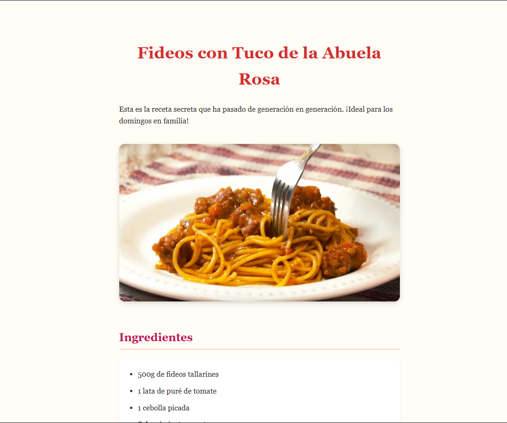
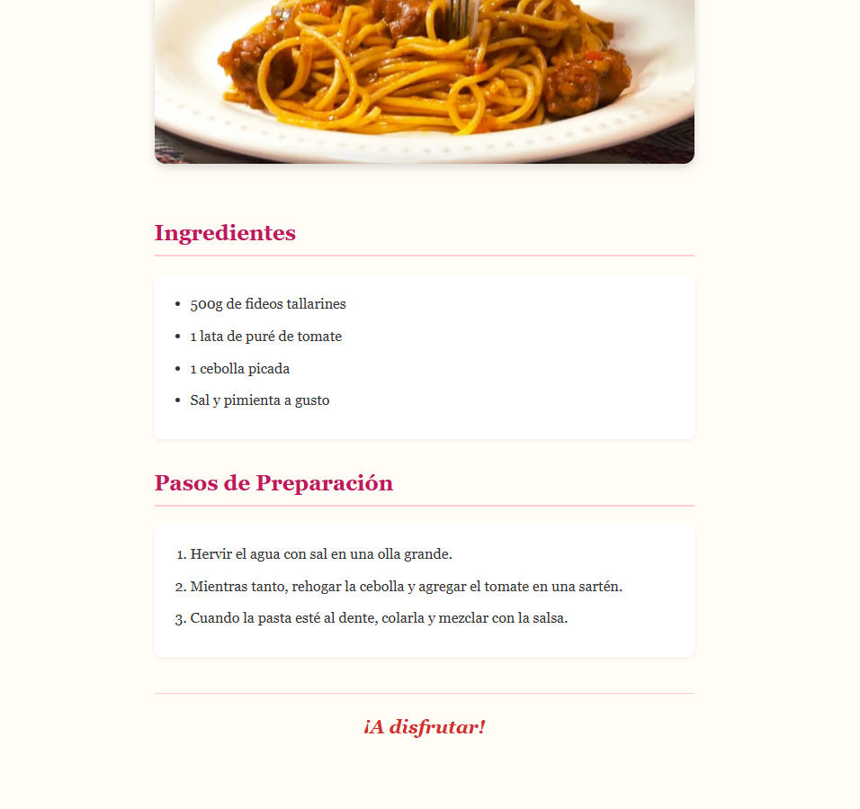

# 👵 Desafío 01: La Receta de la Abuela

¡Bienvenido a tu primer desafío práctico! Hoy vamos a digitalizar la famosa receta de la abuela.

Este ejercicio es fundamental porque casi todas las páginas web del mundo usan lo que vamos a practicar hoy: títulos, párrafos, imágenes y listas. Si dominas esto, dominas el 50% de la estructura web.

---

## 🎯 El Objetivo

Tu misión es crear una página web HTML que estructure la receta siguiendo el modelo de abajo.

Recuerda: **NO** estamos usando CSS todavía. La página se verá "fea", en blanco y negro, con la tipografía por defecto del navegador. ¡Eso es exactamente lo que queremos! Nos importa la estructura, no la belleza (por ahora).

### 👀 Referencia Visual (Resultado Esperado)

> _Nota: Si la imagen de arriba no carga, imagina una página con un título grande, una foto de comida debajo, una lista de ingredientes con puntitos y una lista de pasos con números._

---

## 🔧 Requerimientos Técnicos (Instrucciones)

Abre el archivo `index.html` que está dentro de esta carpeta. Debería estar vacío.

**1. La Estructura Base:**
Escribe `!` y presiona `Tab` para que VS Code te genere el esqueleto básico de HTML5. Cambia el `<title>` por "Receta de la Abuela". Todo tu código debe ir dentro del `<body>`.

**2. El Encabezado Principal:**
Usa la etiqueta de título más importante (`<h1>`) para poner el nombre de la receta: "Fideos con Tuco de la Abuela Rosa".

**3. La Descripción y la Foto:**

- Debajo del título, añade un párrafo (`
`) con una breve introducción que diga: "Esta es la receta secreta que ha pasado de generación en generación. ¡Ideal para los domingos en familia!".
- Debajo del párrafo, inserta la imagen del plato terminado. La imagen ya la tienes en tu carpeta: `assets/plato-final.jpg`. No olvides usar una etiqueta que se cierra sola y añadir un buen texto alternativo (`alt`).

**4. Los Ingredientes (Lista Desordenada):**

- Añade un subtítulo de segundo nivel (`<h2>`) que diga "Ingredientes".
- Queremos una lista con "puntitos" (viñetas). Usa la etiqueta contenedora adecuada para listas desordenadas.
- Dentro, añade al menos 4 ingredientes usando elementos de lista (`<li>`):
  - 500g de fideos tallarines
  - 1 lata de puré de tomate
  - 1 cebolla picada
  - Sal y pimienta a gusto

**5. Los Pasos (Lista Ordenada):**

- Añade otro subtítulo de segundo nivel (`<h2>`) que diga "Pasos de Preparación".
- Esta vez, el orden importa. Queremos una lista numerada (1, 2, 3...). Usa la etiqueta contenedora para listas ordenadas.
- Añade 3 pasos de preparación usando elementos de lista (`<li>`):
  - Hervir el agua con sal en una olla grande.
  - Mientras tanto, rehogar la cebolla y agregar el tomate en una sartén.
  - Cuando la pasta esté al dente, colarla y mezclar con la salsa.

**6. El Pie de Página:**
Al final de todo, añade una línea separadora horizontal (`
`) y un pequeño párrafo final que diga: "¡A disfrutar!".

---

## 💡 Tips y Ayudas

- Si no recuerdas qué etiqueta usar para las listas con puntitos vs. las listas con números, ¡pregúntale a la IA o busca en MDN!
- Recuerda que la ruta de la imagen es relativa. Para entrar a la carpeta `assets`, el `src` debería empezar con `assets/...`.
- Usa **Live Server** para ver cómo va quedando tu página a medida que guardas el archivo.

¡Mucha suerte! Nos vemos en la clase de corrección.
