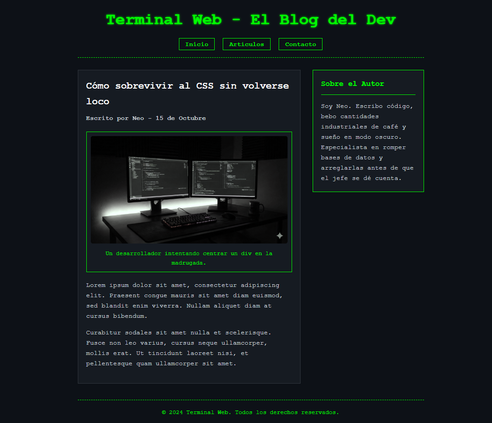

# 💻 Desafío 02: El Blog Hacker (Maquetado Semántico)

¡Bienvenido al segundo desafío! Ya sabes poner textos e imágenes. Ahora vamos a aprender a **estructurar** una página como verdaderos profesionales usando **HTML5 Semántico**.

A simple vista, un navegador muestra un `<article>` y un `
` exactamente igual. Pero para Google (SEO) y para los lectores de pantalla (Accesibilidad), la diferencia es abismal. Hoy vamos a construir la estructura de un artículo de un blog de tecnología.

---

## 🎯 El Objetivo

Construir la estructura de un post de blog utilizando las etiquetas semánticas correctas (`<header>`, `<main>`, `<article>`, `<aside>`, `<footer>`, etc.).

### 👀 Referencia Visual (Resultado Esperado)

> 🚨 **Aclaración del Profe:** La imagen de arriba muestra nuestro diseño "Hacker / Matrix" con fondo oscuro. Recuerda que tú solo estás haciendo el HTML, así que se verá con fondo blanco y letras negras. ¡Concéntrate en que las etiquetas sean las correctas!

---

## 🔧 Requerimientos Técnicos (Instrucciones)

Abre el archivo `index.html` e inicializa el esqueleto básico con `!`. Cambia el título a "Blog Hacker".

Tu `<body>` debe estar dividido estrictamente en estas áreas:

**1. El Encabezado de la Página (`<header>`):**

- Agrega la etiqueta semántica para el encabezado.
- Dentro, pon el nombre del blog en un `<h1>`: "Terminal Web - El Blog del Dev".
- Añade un menú de navegación (`<nav>`) con una lista desordenada (`<ul>`) que tenga tres enlaces (`<a>`): "Inicio", "Artículos", y "Contacto" (los enlaces pueden ir a `#`).

**2. El Contenido Principal (`<main>`):**

- Todo lo importante va dentro de la etiqueta `<main>`.
- **El Artículo (`<article>`):** Dentro del main, abre una etiqueta de artículo. Aquí irá nuestro post.
  - Título del post (`<h2>`): "Cómo sobrevivir al CSS sin volverse loco".
  - Autor y fecha (`
`): "Escrito por Neo - 15 de Octubre".
  - Una imagen representativa. Pero esta vez, **envuelve la `` dentro de una etiqueta `<figure>`**, y añade un `<figcaption>` debajo de la imagen que diga: "Un desarrollador intentando centrar un div".
  - Dos o tres párrafos de texto de relleno (puedes escribir `lorem` y presionar Tab en VS Code para generar texto automático).
- **La Barra Lateral (`<aside>`):** Aún dentro del `<main>` pero **fuera** del `<article>`, añade una etiqueta aside. Esta representará una barra lateral de contenido extra.
  - Pon un título (`<h3>`): "Sobre el Autor".
  - Un párrafo breve que describa a un hacker misterioso que toma mucho café.

**3. El Pie de Página (`<footer>`):**

- Al final del `<body>` (fuera del `<main>`), añade el pie de página.
- Pon un párrafo que diga: "© 2024 Terminal Web. Todos los derechos reservados."

---

## 💡 Tips y Ayudas

- Imagina la página como cajas dentro de cajas. El `<main>` es la caja grande del centro, y adentro tiene dos sub-cajas: el `<article>` (el post) y el `<aside>` (la barra lateral).
- La etiqueta `<figure>` es perfecta para agrupar una imagen con su texto descriptivo (`<figcaption>`). ¡A Google le encanta esto!
