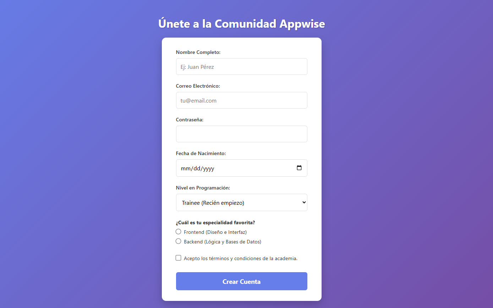

# 🛡️ Desafío 03: Registro de Usuario (Formularios)

¡Bienvenido al tercer desafío! Hasta ahora nuestras páginas solo mostraban información. Hoy vamos a crear el puente entre el usuario y nosotros: **Los Formularios**.

En este ejercicio vas a maquetar la pantalla de registro para la comunidad de Appwise. Vas a aprender que no todos los campos de texto son iguales y cómo HTML5 nos ayuda a validar datos sin escribir ni una sola línea de JavaScript.

---

## 🎯 El Objetivo

Construir un formulario de registro completo utilizando la etiqueta `<form>` y los diferentes tipos de `<input>`.

### 👀 Referencia Visual (Resultado Esperado)

_(Profe: Reemplaza esta línea con la captura de pantalla de tu versión con CSS)_

> 🚨 **Aclaración del Profe:** Como siempre, tú solo escribirás el esqueleto (HTML). En tu navegador verás los campos uno al lado del otro o de forma muy básica. ¡No te preocupes por el diseño, enfócate en usar los `type` correctos en los inputs!

---

## 🔧 Requerimientos Técnicos (Instrucciones)

Abre el archivo `index.html` e inicializa el esqueleto básico. Cambia el título a "Registro - Appwise". Todo tu contenido irá dentro del `<body>`.

**1. El Contenedor Principal:**

- Añade un título `<h1>` que diga: "Únete a la Comunidad Appwise".
- Crea la etiqueta contenedora maestra para formularios (`<form>`). Puedes ponerle el atributo `action="#"` por ahora. Todo lo que sigue va dentro de esta etiqueta.

**2. Datos Personales (Cajas de texto):**

- **Nombre:** Crea una etiqueta `<label>` que diga "Nombre Completo". Debajo, añade un `<input>` de tipo texto. _¡Importante!_ Usa los atributos `id` y `for` para enlazar el label con el input. Haz que este campo sea obligatorio (`required`).
- **Email:** Crea un label y un input. El input **debe** ser de un tipo específico para correos electrónicos (así en los celulares aparece el "@" en el teclado).
- **Contraseña:** Crea un label y un input. El texto que el usuario escriba debe verse oculto (con puntitos o asteriscos).

**3. Datos Extra (Fechas y Opciones):**

- **Fecha de Nacimiento:** Añade un label y un input que despliegue un calendario nativo.
- **Nivel de Experiencia (Desplegable):** Crea un label que diga "Nivel en Programación". Debajo, usa la etiqueta `<select>`. Dentro de ella, añade tres opciones (`<option>`): "Trainee", "Junior", y "Semi-Senior".

**4. Selección Única (Radio Buttons):**

- Añade un subtítulo `<h3>` o un párrafo en negrita que diga: "¿Cuál es tu especialidad favorita?".
- Crea dos inputs de tipo `radio`: uno para "Frontend" y otro para "Backend".
- _Truco:_ Para que solo se pueda seleccionar uno de los dos a la vez, ambos inputs deben tener el **mismo atributo `name`**.

**5. El Checkbox Final y el Botón:**

- Crea un input de tipo `checkbox`. Enlázalo con un label que diga: "Acepto los términos y condiciones". Haz que sea obligatorio (`required`).
- Finalmente, crea un botón (`<button>`) con el texto "Crear Cuenta". Asegúrate de que su `type` sea el correcto para enviar el formulario.

---

## 💡 Tips y Ayudas

- Recuerda la regla de oro de la accesibilidad: El atributo `for` del `<label>` debe ser exactamente igual al atributo `id` del `<input>`. Pruébalo haciendo clic en la palabra "Nombre Completo"; si el input se activa, ¡lo hiciste perfecto!
- El input de Email tiene validación nativa. Si escribes "hola" y le das a enviar, el navegador te dirá automáticamente que le falta el "@".
