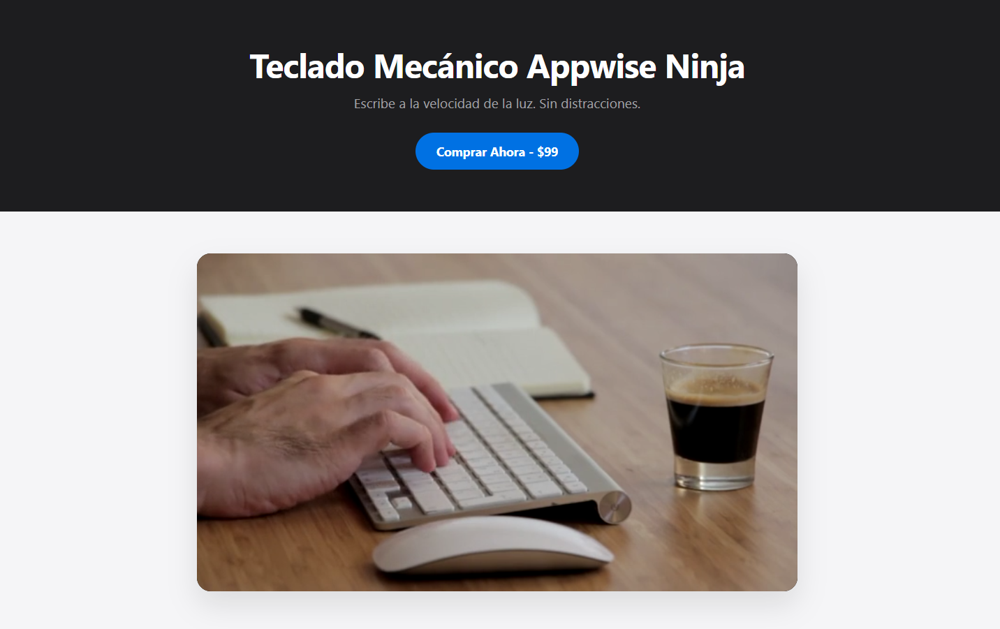
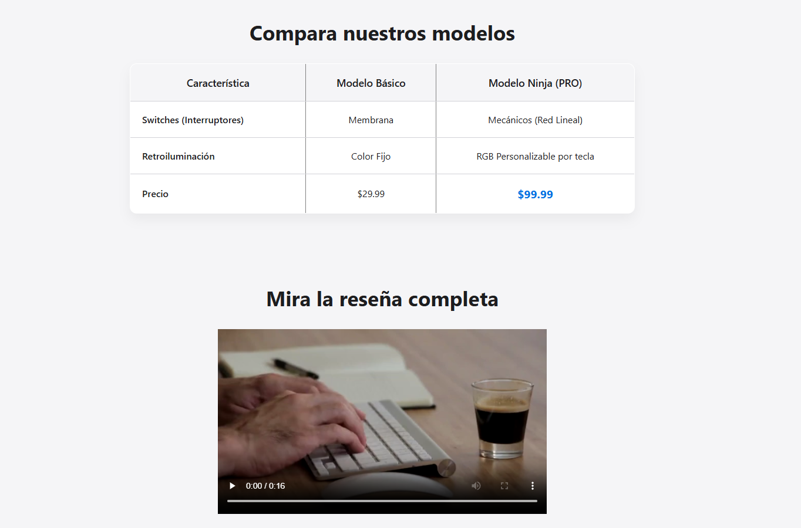
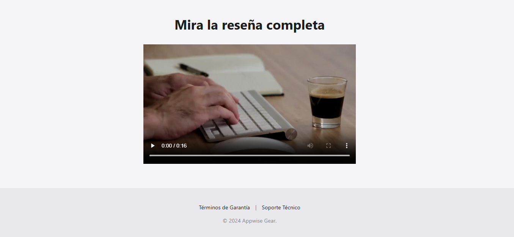

# 🚀 Desafío 04: Landing Page de Producto (Multimedia)

¡Llegamos a las grandes ligas! Las "Landing Pages" son páginas web diseñadas específicamente para vender un producto o servicio. Si trabajas como freelance, te pedirán esto todo el tiempo.

Hoy vamos a maquetar la página de ventas del nuevo **Teclado Mecánico Appwise Ninja**. Para vender, necesitamos mostrar el producto en acción, así que hoy aprenderemos a incrustar videos nativos, videos de YouTube y a construir tablas de precios.

---

## 🎯 El Objetivo

Construir la estructura de una Landing Page comercial utilizando etiquetas multimedia (`<video>`, `<iframe>`) y tablas (`<table>`).

### 👀 Referencia Visual (Resultado Esperado)

> 🚨 **Aclaración del Profe:** Como siempre, al escribir solo HTML, tu video se verá gigante, la tabla se verá sin bordes lindos y todo estará apilado a la izquierda. ¡Es normal! Estamos construyendo los cimientos del edificio comercial.

---

## 🔧 Requerimientos Técnicos (Instrucciones)

Abre el archivo `index.html` e inicializa el esqueleto básico. Cambia el título a "Teclado Appwise Ninja".

**1. El Encabezado (`<header>`):**

- Añade un título `<h1>`: "Teclado Mecánico Appwise Ninja".
- Un párrafo corto promocional: "Escribe a la velocidad de la luz. Sin distracciones."
- Un botón de compra (`<button>`): "Comprar Ahora - $99".

**2. Sección Hero - Video Nativo (`<section>`):**

- Crea una sección para mostrar nuestro producto.
- Inserta el video promocional usando la etiqueta nativa `<video>`. El video está en `assets/promo.mp4`.
- **Regla de oro:** El video debe reproducirse solo (`autoplay`), en silencio (`muted`), repetirse infinitamente (`loop`) y NO debe tener los controles visibles para que parezca un fondo cinemático. (¡Busca estos atributos en MDN si no los recuerdas!).

**3. Tabla de Precios (`<section>` y `<table>`):**

- Crea otra sección con un `<h2>` que diga "Compara nuestros modelos".
- Debajo, crea una tabla (`<table>`).
- Usa `<thead>` para la cabecera. Debe tener una fila (`<tr>`) con tres columnas de título (`<th>`): "Característica", "Modelo Básico", "Modelo Ninja".
- Usa `<tbody>` para el cuerpo. Añade al menos 3 filas (`<tr>`) con datos (`<td>`). Por ejemplo, compara "Switches", "Retroiluminación" y "Precio".

**4. Demo en Vivo - Video privado de AppWise (`<section>` y `<iframe>`):**

- Crea una última sección con un `<h2>` que diga "Mira la reseña completa".
- Usa la etiqueta `<iframe>` para incrustar un video real de YouTube.
- _Truco:_ Ve a cualquier video de YouTube, haz clic en "Compartir" -> "Insertar" y copia el código `<iframe>` que te dan ahí.
- Link: 'https://appwiseinnovations.dev/ACADEMY/promo.mp4'

**5. El Pie de Página (`<footer>`):**

- Cierra la página con un footer que contenga un enlace (`<a>`) a "Términos de Garantía" y otro a "Soporte Técnico".

---

## 💡 Tips y Ayudas

- Las tablas HTML pueden ser confusas al principio. Recuerda la jerarquía: `table` > `thead`/`tbody` > `tr` (Fila) > `th`/`td` (Celda).
- Si tu video nativo no se reproduce automáticamente, asegúrate de haberle puesto el atributo `muted`. Los navegadores bloquean el autoplay de videos con sonido para no molestar al usuario.
