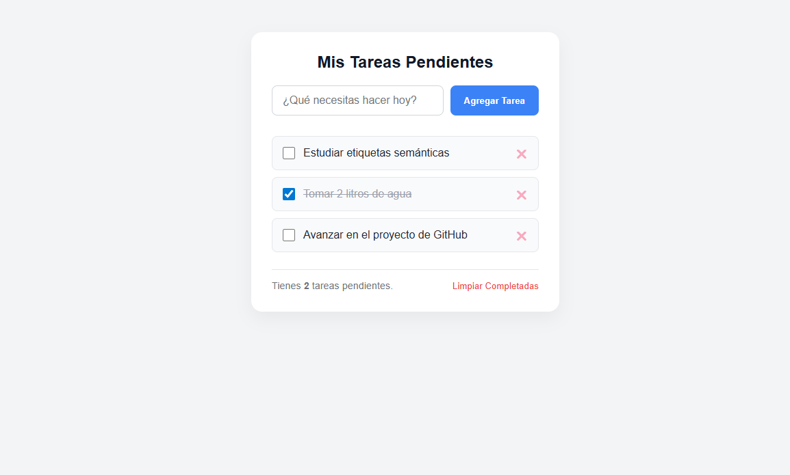

# 📝 Desafío 05: Gestor de Tareas (ToDo List)

¡Llegaste a la mitad de los proyectos! Te presento a la aplicación reina de la programación: **La lista de tareas** o _ToDo List_.

Cualquier aplicación interactiva moderna es, en el fondo, una lista de tareas. Un tuit es una "tarea" que se publica y se borra. Un producto en un carrito es una "tarea" que se compra. Hoy vamos a construir el esqueleto de nuestra propia app de productividad.

---

## 🎯 El Objetivo

Construir una interfaz de usuario limpia para agregar y visualizar tareas. Utilizaremos inputs, botones, y listas (`<ul>`, `<li>`), preparándonos para hacer esta lista dinámica más adelante.

### 👀 Referencia Visual (Resultado Esperado)

> 🚨 **Aclaración del Profe:** Vas a escribir un par de "tareas falsas" directamente en tu HTML. En el futuro, esas tareas nacerán vacías y las agregaremos nosotros mismos tecleando y usando JavaScript. ¡Pero primero necesitamos el molde!

---

## 🔧 Requerimientos Técnicos (Instrucciones)

Abre tu archivo `index.html` vacío y prepara la estructura base. Título: "Gestor de Tareas".

**1. El Contenedor Principal (`<main>`):**

- Todo debe ir dentro de un `<main>`.
- Añade un encabezado `<h1>` que diga: "Mis Tareas Pendientes".

**2. La Caja de Entrada (Input y Botón):**

- Crea una sección (`<section>`) o un `
` que agrupe los controles.
- Agrega un `<input>` de tipo texto. Ponle un `placeholder` que diga: "¿Qué necesitas hacer hoy?".
- Agrega un `<button>` al lado que diga: "Agregar Tarea".

**3. La Lista de Tareas (`<ul>`):**

- Debajo de la caja de entrada, crea una lista desordenada (`<ul>`).
- **Aquí está el truco de la interfaz:** Cada elemento de la lista (`<li>`) debe tener adentro tres cosas:
  1. Un `<input>` de tipo `checkbox` (para marcar la tarea como completada).
  2. Un `` o texto normal con el nombre de la tarea (ej: "Estudiar HTML").
  3. Un `<button>` pequeño que diga "❌" o "Borrar".
- Escribe al menos 3 tareas (`<li>`) de ejemplo (hardcodeadas) para ver cómo queda la estructura. A una de ellas, ponle el atributo `checked` a su checkbox para simular que ya la terminaste.

**4. El Pie de la Lista:**

- Añade un párrafo `
` final que diga: "Tienes 2 tareas pendientes." (Este número luego lo calcularemos mágicamente).
- Añade un botón que diga: "Limpiar Completadas".

---

## 💡 Tips y Ayudas

- Acostúmbrate a pensar en "Componentes". Cada `<li>` es un pequeño componente que se repite. Asegúrate de que tu primer `<li>` esté bien estructurado antes de copiar y pegar los siguientes.
- El uso de `` para envolver el texto de la tarea es una muy buena práctica, ya que nos permitirá tachar ese texto fácilmente con CSS más adelante.
