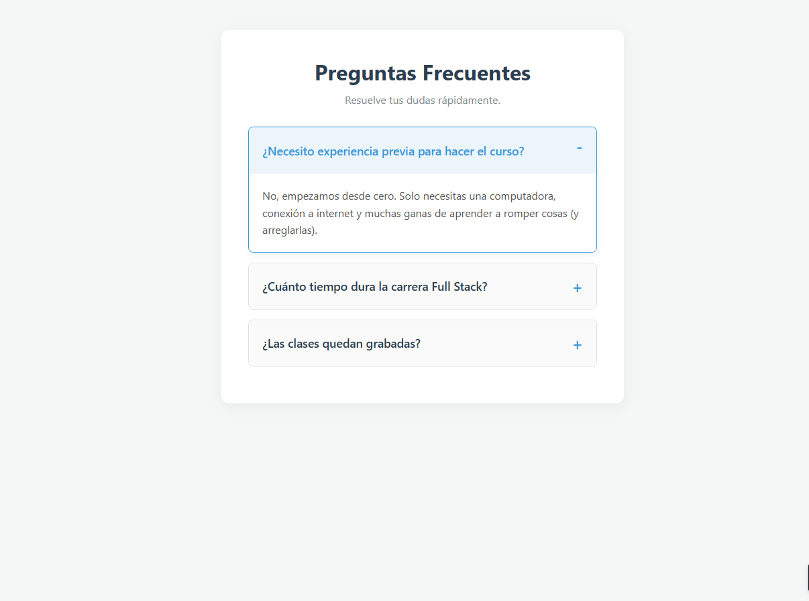

# ❓ Desafío 06: Centro de Ayuda (Acordeón FAQ)

¡Bienvenido al sexto desafío! Hasta hace unos años, si querías hacer una lista de preguntas donde al hacer clic se desplegara la respuesta, tenías que escribir un montón de código JavaScript.

Hoy, HTML5 tiene "superpoderes" nativos. En este proyecto vamos a construir la sección de Preguntas Frecuentes (FAQ) de Appwise usando interactividad 100% nativa.

---

## 🎯 El Objetivo

Construir un acordeón interactivo utilizando las etiquetas `
` y `
`.

### 👀 Referencia Visual (Resultado Esperado)

> 🚨 **Aclaración del Profe:** Vas a notar que, sin CSS, las preguntas tienen una flechita negra muy básica a la izquierda. Ese es el comportamiento por defecto del navegador. En este desafío, ¡lo importante es que funcione el clic!

---

## 🔧 Requerimientos Técnicos (Instrucciones)

Prepara tu archivo `index.html`. Título: "Centro de Ayuda - Appwise".

**1. El Encabezado:**

- Crea un contenedor principal (`<main>`).
- Añade un título `<h1>` que diga: "Preguntas Frecuentes".
- Añade un párrafo `
` que diga: "Resuelve tus dudas rápidamente."

**2. La Lista de Preguntas (El Acordeón):**

- Agrupa todas las preguntas en una `<section>`.
- Por cada pregunta frecuente, debes crear un bloque interactivo usando la etiqueta `
`.
- Dentro de cada `
`, la **pregunta** (lo que siempre está visible) debe ir envuelta en la etiqueta `
`.
- Debajo de la etiqueta `
`, pon la **respuesta** dentro de un párrafo normal (`
`). Esta respuesta estará oculta hasta que el usuario haga clic.

**3. Datos de Prueba:**
Crea al menos 3 bloques `
` con estas preguntas y respuestas:

- **Pregunta 1:** ¿Necesito experiencia previa para hacer el curso?
  - _Respuesta:_ No, empezamos desde cero. Solo necesitas una computadora y ganas de aprender.
- **Pregunta 2:** ¿Cuánto tiempo dura la carrera Full Stack?
  - _Respuesta:_ El programa completo dura 9 meses, con clases en vivo y proyectos prácticos semanales.
- **Pregunta 3:** ¿Las clases quedan grabadas?
  - _Respuesta:_ ¡Sí! Todas las clases se graban y se suben a la plataforma para que puedas repasarlas cuando quieras.

**Truco Extra:** Si quieres que la primera pregunta ya aparezca abierta por defecto cuando se carga la página, añádele el atributo `open` a la etiqueta `
`. (Ej: `
`).

---

## 💡 Tips y Ayudas

- La estructura estricta siempre debe ser:
  `
` (La caja contenedora)
  `
` La Pregunta `
`
  `
` La Respuesta `
`
  `
`
- ¡Prueba hacer clic en las preguntas en tu navegador! Verás cómo se abren y cierran solas sin necesidad de programación extra.
