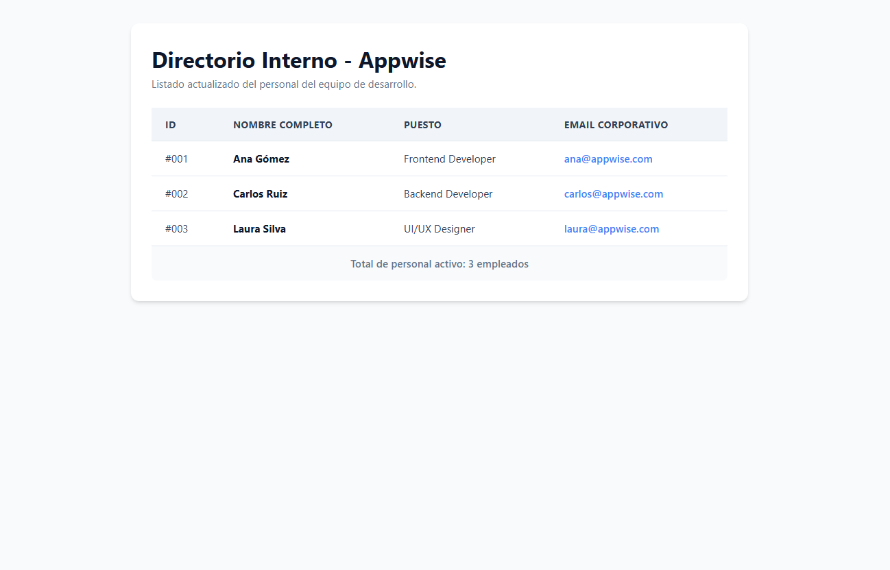

# 📊 Desafío 07: Directorio de Empleados (Tablas)

¡Bienvenido al séptimo desafío! Cuando entres a trabajar a una empresa, te vas a cansar de hacer "Dashboards" (Paneles de control) para los administradores. Y el corazón de cualquier panel de control es la **Tabla de Datos**.

Hoy vamos a dejar de lado los diseños creativos y nos vamos a enfocar en la estructura de datos tabulares.

---

## 🎯 El Objetivo

Construir una tabla semántica y bien estructurada que muestre el directorio de los empleados de nuestra empresa ficticia.

### 👀 Referencia Visual (Resultado Esperado)

_(Profe: Reemplaza con tu captura de pantalla de la tabla con CSS)_

> 🚨 **Aclaración del Profe:** Las tablas en HTML puro (sin CSS) se ven literalmente como un documento de Word de 1995. Recuerda ponerle el atributo `border="1"` temporalmente a tu etiqueta `<table>` para que puedas ver las líneas mientras trabajas.

---

## 🔧 Requerimientos Técnicos (Instrucciones)

Abre el archivo `index.html` e inicializa la estructura básica. Título: "Directorio de Empleados".

**1. El Encabezado de la Página:**

- Dentro de un `<main>`, añade un `<h1>` con el texto "Directorio Interno - Appwise".
- Un párrafo descriptivo debajo.

**2. La Estructura de la Tabla:**

- Crea la etiqueta contenedora principal: `<table>`. (Puedes añadirle `border="1"` por ahora).
- Las tablas modernas se dividen en dos grandes bloques: La cabeza (`<thead>`) y el cuerpo (`<tbody>`). Añade ambas etiquetas dentro de tu tabla.

**3. La Cabecera (`<thead>`):**

- Dentro del `<thead>`, crea **una fila** usando la etiqueta `<tr>` (Table Row).
- Dentro de esa fila, añade 4 celdas de título usando `<th>` (Table Head).
- Los títulos deben ser: "ID", "Nombre", "Puesto" y "Email".

**4. El Cuerpo de la Tabla (`<tbody>`):**

- Aquí irán los datos. Crea al menos **3 filas** (`<tr>`).
- Dentro de cada fila, debes poner exactamente 4 celdas de datos regulares usando `<td>` (Table Data), para que coincidan con las columnas de tu cabecera.
- _Ejemplo para la primera fila:_
  - Celda 1 (`<td>`): #001
  - Celda 2 (`<td>`): Ana Gómez
  - Celda 3 (`<td>`): Frontend Developer
  - Celda 4 (`<td>`): ana@appwise.com (¡Haz que este email sea un enlace cliqueable usando `<a href="mailto:...">`!)

**5. El Resumen (Opcional/Bonus):**

- Después del `<tbody>`, puedes añadir un `<tfoot>` (Pie de tabla) con una fila que ocupe todas las columnas diciendo: "Total de empleados: 3". (Pista: investiga el atributo `colspan`).

---

## 💡 Tips y Ayudas

- **El orden es vital:** Si tu cabecera tiene 4 columnas (`<th>`), asegúrate de que cada fila de tu cuerpo tenga exactamente 4 celdas (`<td>`), de lo contrario la tabla se "romperá" visualmente.
- Recuerda la regla mnemotécnica: **TR** = Table Row (Fila horizontal). **TD** = Table Data (La celda individual adentro de la fila).
