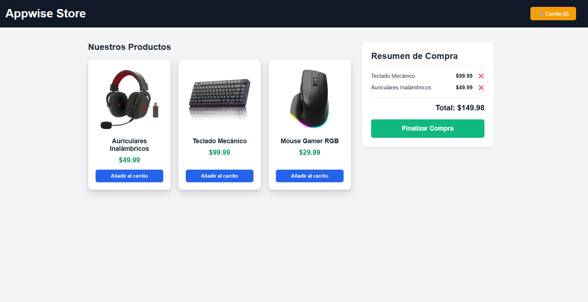

# 🛒 Desafío 08: Carrito de Compras (Layout y Sidebar)

¡Bienvenido al octavo desafío! Si hay algo que da dinero en internet, son las tiendas online (E-commerce). Y el corazón de cualquier tienda es su carrito de compras.

Hoy vamos a maquetar la estructura de una tienda de tecnología. El reto aquí es pensar en "bloques" o "columnas". Tendremos un bloque principal para los productos y una barra lateral para el resumen de la compra.

---

## 🎯 El Objetivo

Estructurar la página dividiendo el contenido principal (productos) de la barra lateral (el carrito de compras) usando las etiquetas semánticas correctas.

### 👀 Referencia Visual (Resultado Esperado)

> 🚨 **Aclaración del Profe:** En HTML puro, tu "barra lateral" del carrito no aparecerá al lado de los productos, sino debajo de ellos. ¡El HTML no sabe de diseños en columnas! Lo importante es que uses la etiqueta `<aside>` para el carrito, preparando el terreno para cuando usemos CSS.

---

## 🔧 Requerimientos Técnicos (Instrucciones)

Inicializa tu archivo `index.html`. Título: "Tienda Appwise".

**1. El Encabezado (`<header>`):**

- Añade un `<h1>` que diga "Appwise Store".
- Añade un botón que simule ser el icono del carrito: "🛒 Ver Carrito (2)".

**2. El Contenedor Principal (`<main>`):**

- Abre la etiqueta `<main>`. Todo lo que sigue va aquí adentro.

**3. La Lista de Productos (`<section>`):**

- Crea una sección para los productos. Ponle un título `<h2>` ("Nuestros Productos").
- Crea una lista de productos. Puedes usar un `
` o un `<article>` por cada producto.
- Añade los 3 productos usando las imágenes que tienes en la carpeta `assets/`. Cada uno debe tener:
  - La etiqueta `` apuntando a las fotos proporcionadas (`auricular_gamer.webp`, `teclado_mecanico.webp`, `mouse_gamer.webp`).
  - Un título `<h3>` con el nombre del producto.
  - Un precio `
` (Ej: "$49.99").
  - Un `<button>` que diga "Añadir al carrito".

**4. El Resumen del Carrito (`<aside>`):**

- Aún dentro del `<main>`, pero debajo de la sección de productos, añade la etiqueta `<aside>`. Esta etiqueta indica que es contenido secundario (nuestra barra lateral).
- Ponle un `<h2>` ("Resumen de Compra").
- Crea una lista (`<ul>`) con dos de los productos que supuestamente ya añadimos.
- Cada `<li>` de la lista debe tener el nombre del producto, el precio y un botón chiquito de "❌" para eliminarlo.
- Al final del `<aside>`, añade una línea separadora `
`, un `<h3>` con el Total (Ej: "Total: $149.98") y un botón gigante que diga "Finalizar Compra".

---

## 💡 Tips y Ayudas

- Imagina la pantalla dividida en dos. El 70% izquierdo es tu `<section>` de productos. El 30% derecho es tu `<aside>` del carrito. Esa es la estructura mental que debes plasmar en el código.
- Usa la etiqueta `<strong>` o `<b>` para resaltar los precios y que el usuario los vea rápido.
