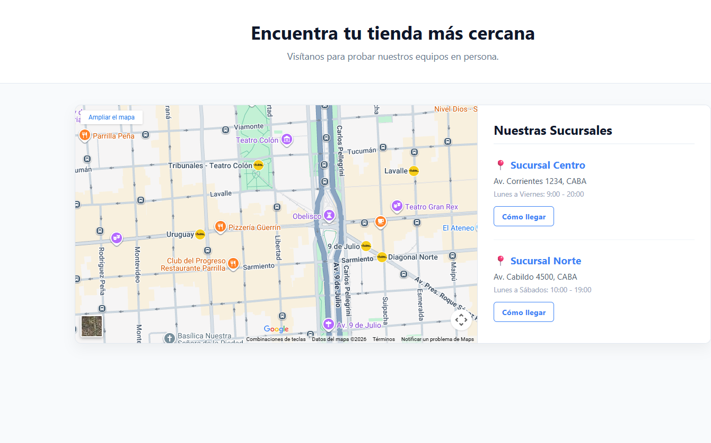

# 🗺️ Desafío 09: Buscador de Sucursales (Iframes y Mapas)

¡Ya casi llegamos al final! Todo negocio físico necesita mostrarle a sus clientes dónde encontrarlo. Hoy vamos a construir un "Store Locator" (Buscador de Sucursales).

Para hacer esto, no necesitamos dibujar un mapa desde cero; vamos a pedirle prestado el mapa a Google y lo vamos a incrustar en nuestra web utilizando la poderosa etiqueta `<iframe>`.

---

## 🎯 El Objetivo

Aprender a incrustar contenido de terceros (Google Maps) combinándolo con una lista de direcciones maquetada semánticamente.

### 👀 Referencia Visual (Resultado Esperado)

> 🚨 **Aclaración del Profe:** Como siempre, en tu HTML puro el mapa probablemente aparezca gigante o desacomodado respecto a la lista de texto. Recuerda que HTML solo estructura el contenido, el diseño a dos columnas se lo daremos luego con CSS.

---

## 🔧 Requerimientos Técnicos (Instrucciones)

Inicializa tu archivo `index.html`. Título: "Sucursales - Appwise".

**1. El Encabezado:**

- Crea un `<header>` con un título `<h1>` que diga: "Encuentra tu tienda más cercana".
- Añade un párrafo explicativo corto.

**2. El Contenedor Principal (`<main>`):**

- Abre la etiqueta `<main>`. Dividiremos este bloque en dos partes: el mapa y la lista de direcciones.

**3. El Mapa Incrustado (`<section>` o `<figure>`):**

- Ve a [Google Maps](https://www.google.com/maps), busca un lugar conocido (ej: El Obelisco, o tu ciudad).
- Haz clic en el botón **"Compartir"** y luego en la pestaña **"Insertar un mapa"**.
- Copia el código HTML que te da Google (verás que empieza con `<iframe src="...">`).
- Pega ese código en tu archivo. ¡No olvides ponerle un atributo `title="Mapa de sucursales"` al iframe para la accesibilidad!

**4. La Lista de Sucursales (`<aside>` o `<section>`):**

- Crea un bloque para listar las direcciones.
- Ponle un título `<h2>` ("Nuestras Sucursales").
- Usa una lista desordenada (`<ul>`) para agregar al menos 2 sucursales.
- Cada sucursal (`<li>`) debe tener:
  - El nombre de la sucursal en negrita (Ej: **Sucursal Centro**).
  - La dirección exacta (Ej: Av. Corrientes 1234).
  - Los horarios de atención.
  - Un enlace (`<a>`) que diga "Ver en el mapa" (por ahora, el `href` puede ser `#`).

---

## 💡 Tips y Ayudas

- La etiqueta `<iframe>` es literalmente una "ventana" hacia otra página web. Puedes usarla para mapas, videos de YouTube, listas de reproducción de Spotify, ¡o hasta juegos!
- Revisa los atributos de tu iframe: `width` y `height` controlan su tamaño base en HTML.
