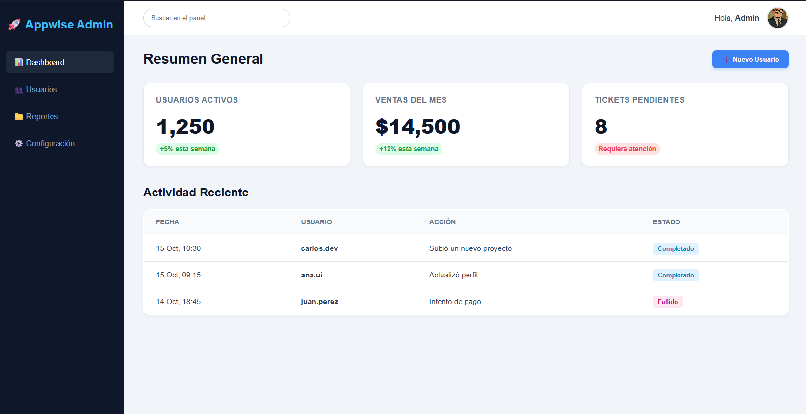

# 🏆 Desafío 10: El Jefe Final (Dashboard Admin)

¡Felicitaciones por llegar hasta aquí! Estás a punto de enfrentarte al desafío definitivo.

El 80% del software corporativo en el mundo no son páginas bonitas de ventas, son "Dashboards" (Paneles de Administración) donde los empleados gestionan datos. Hoy vas a construir el esqueleto del panel de control interno de Appwise.

---

## 🎯 El Objetivo

Combinar todo lo aprendido en el curso: Semántica avanzada, enlaces, tablas, formularios interactivos y layout en múltiples zonas. Además, introduciremos la etiqueta `<dialog>` para crear ventanas emergentes (Modales) nativas.

### 👀 Referencia Visual (Resultado Esperado)

> 🚨 **Aclaración del Profe:** Esta es una estructura compleja. En HTML puro verás todo apilado hacia abajo en una sola columna larguísima. No te frustres, es el comportamiento correcto. Piensa en esto como los planos arquitectónicos de un rascacielos.

---

## 🔧 Requerimientos Técnicos (Instrucciones)

Prepara tu archivo `index.html`. Título: "Admin Panel - Appwise".

**1. La Barra Lateral (`<aside>`):**

- Abre el `<body>`. El primer gran bloque será nuestro menú lateral. Usa la etiqueta `<aside>`.
- Dentro, pon un título o logo (Ej: `<h2>Appwise Admin</h2>`).
- Añade un menú de navegación (`<nav>`) con una lista (`<ul>`) de enlaces: "Dashboard", "Usuarios", "Reportes" y "Configuración".

**2. El Área de Contenido (`<main>`):**

- Debajo (fuera) del `<aside>`, abre la etiqueta `<main>`. Todo lo demás irá aquí adentro.

**3. La Barra Superior (`<header>` inside `<main>`):**

- Dentro del `<main>`, pon un `<header>`.
- Debe contener un buscador (`<input type="search">`) y el perfil del usuario (una foto `` y su nombre "Admin").

**4. Tarjetas de Métricas (`<section>`):**

- Crea una sección para los números rápidos.
- Dentro, crea 3 tarjetas (puedes usar `<article>`).
- Cada tarjeta debe tener un título `<h3>` (Ej: "Usuarios Activos") y un número gigante en un párrafo `
` (Ej: "1,250").

**5. Tabla de Actividad Reciente (`<section>` y `<table>`):**

- Crea otra sección con un `<h2>` ("Actividad Reciente").
- Añade una tabla (`<table>`) con su `<thead>` y `<tbody>`.
- Cabeceras: "Fecha", "Usuario", "Acción", "Estado".
- Añade al menos 3 filas de datos.

**6. El Toque de Magia: El Modal (`<dialog>`):**

- Al final de tu `<body>` (puede ser fuera del `<main>`), añade la etiqueta `<dialog>`.
- **Truco:** Ponle el atributo `open` para que puedas verlo en tu pantalla (`<dialog open>`).
- Dentro del dialog, pon un `<h3>` ("Añadir Nuevo Usuario"), un pequeño `<form>` con un input para el nombre, y dos botones: "Guardar" y "Cancelar".

---

## 💡 Tips y Ayudas

- Estructura mental: El `<body>` tiene dos hijos principales directos: el `<aside>` (menú izquierdo) y el `<main>` (todo el lado derecho).
- La etiqueta `<dialog>` es increíble. Si le quitas el atributo `open`, desaparece mágicamente. En el próximo módulo, usaremos JavaScript para hacer que un botón le ponga y le quite ese atributo dinológicamente.
